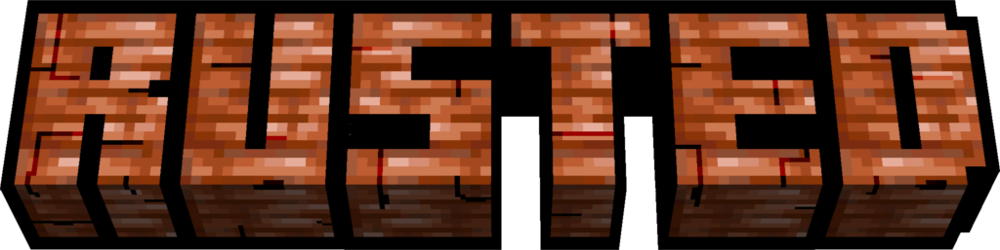

  

# **Rusted**

**Corrosion Takes Hold of Your World.**

---

### **Overview**
**Rusted** is a vanilla-friendly mod that extends the copper oxidation mechanic directly to vanilla Iron Blocks and new Cut Iron variants. Add realism and depth to your builds by watching metal structures corrode through four distinct rust stages.

---

### **Features**

* **Oxidation System:** Iron blocks and structural variants naturally progress through four distinct rust stages.
* **Environmental Accelerators:** Weather exposure and water contact increase the rate of corrosion.
* **Surface Maintenance:** Lock blocks at any oxidation state using Honeycomb, or strip rust and wax using an Axe.
* **Customization & Localization:** Fully configurable mechanics with native support for multiple languages.

---

### **Integrations & Compatibility**

* **Create Mod:** Full compatibility with Create's Industrial Iron blocks, windows, and window panes.
* **Recipe Viewers:** Native support for EMI, JEI, and REI to display oxidation cycles and interaction outcomes.

---

### **Requirements**
To ensure compatibility, please use the following versions:

* **Minecraft:** `1.21.1`
* **NeoForge:** `21.1.208` or higher
* **Create (Optional):** `6.0.0` or higher

---

### **Resources**
* 📦 **Modrinth:** [Project Page](https://modrinth.com/mod/rusted)
* 🔥 **CurseForge:** [Project Page](https://www.curseforge.com/minecraft/mc-mods/rusted)
* 🛠️ **Issue Tracker:** [Report a Bug](https://github.com/ripiters/Rusted/issues)
* 📜 **License:** MIT

---

📜 License & Credits

This mod is licensed under the **MIT License**.

* **Code & Logic:** Developed by ripiters.
* **Texture Credits:** Original textures inspired by/modified from Lemon's Rusted Iron mod.

Full attribution and licensing information can be found in the `CREDITS.txt` file included with the mod file.

#

  Built with passion for the Minecraft community.

